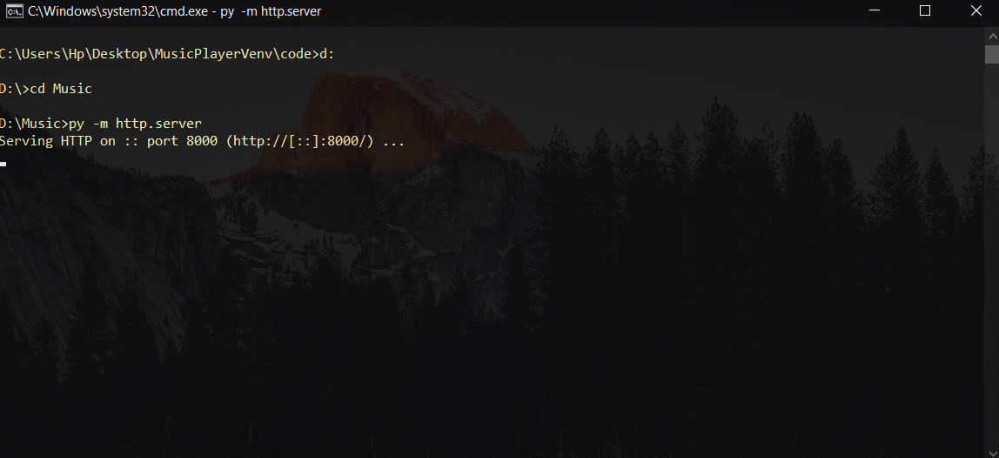
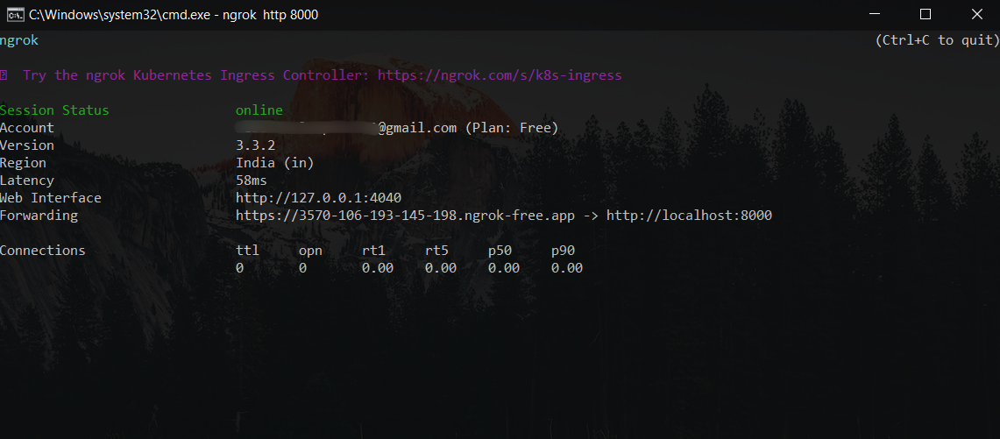
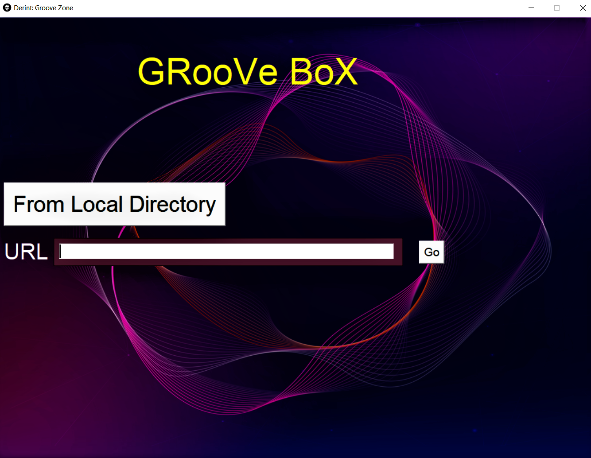
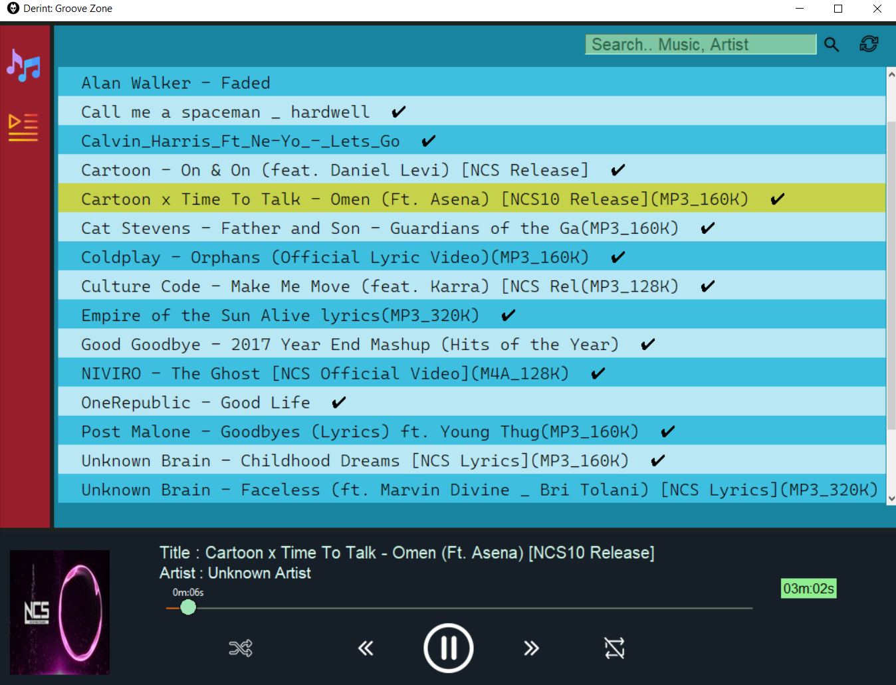

# Introducing GrooveZone: Your Ultimate Music Companion

Greetings, music enthusiasts! 🎵 You know how deeply music resonates with us all, right? Well, I've been engrossed in developing a cutting-edge marvel named GrooveZone – a music player that boasts an array of impressive features!

## What's in the GrooveZone Arsenal?

Prepare to be amazed, as GrooveZone delivers everything you'd anticipate from a top-tier music player:

- **Play and Pause:** Launch your cherished tunes and halt them at your whim. It's akin to having a remote control for your musical journey!
- **Shuffle and Repeat:** Craving unpredictability in your playlist? GrooveZone can randomize your songs. And if a track has ensnared your senses, a simple tap on repeat will keep it resonating in an enchanting loop.
- **Revitalize Your Library:** Envision your music collection as a vibrant garden that occasionally craves nurturing. GrooveZone ensures your library is perpetually invigorated, staying abreast of the latest sonic offerings.
- **Discover Your Anthems:** Even when submerged in a colossal playlist, fear not. Just input a few characters, and like a musical magician, GrooveZone will conjure the sought-after melody.

## The Game-Changer: Bridging Local and Online Melodies

Now, brace yourself for the pièce de résistance. Remember those cherished tracks residing on your device? GrooveZone not only harmonizes with them but also serenades you with tunes from the vast expanses of the internet.

## Table of Contents
- [Installation](#installation)
- [Usage](#usage)
- [Known Issues](#known-issues)

## Package Installation
**Prepping the Environment**: I would recommend the use of a Virtual Environment.

- Windows: `pip install virtualenv`
- Linux: `pip3 install virtualenv`

**Activating the Virtual Environment**:
- Windows: `.\venv\Scripts\activate`
- Linux: `source ./venv/bin/activate`

**Install the Necessary Packages**:
`pip install -r requirements.txt`

**For Linux System -** *Installing FFMPEG & Tkinter*: 
`sudo apt update` 
`sudo apt-get install python3-tk` 
`sudo apt install ffmpeg`

## Usage
**Start the server where your audio files are stored**:

**If you want music from far away or on different devices, use network tunneling service (like Ngrok).**:

### <b>To start the music playing, run python main.py</b>

At this point, you have the option to either select sounds from your Local Directory or retrieve them from a remote URL.

###### ***Background image source***: [Image courtesy of rawpixel.com on Freepik](https://www.freepik.com/free-vector/virtual-assistant-technology-vector-irregular-circle-shape-pink_16268287.htm#query=ai%20music&position=22&from_view=keyword&track=ais)
 

**Double Click To Start Playing Songs**

 

### Known Issues 
##### Bug: Song Slider Moving Too Fast

- **Bug Description:** I've identified an issue with the song slider in GrooveZone that causes it to move too quickly when the next or previous button is pressed.

- **Steps to Reproduce:** To encounter this bug, follow these steps:
  1. Start playing a song.
  2. Press the next or previous button to switch to another song.
  3. Now drag the Slider & Observe that the song slider moves at an unusually accelerated pace.

- **Temporary Workaround:** While I work on resolving this, you can still play songs, just don't drag the slider.
